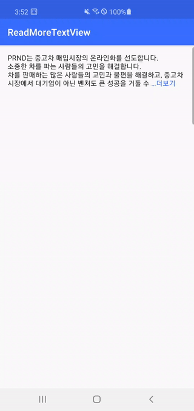

# What is ReadMoreTextView
- Sometimes if TextView's text is too long, we want collapse text
- It looks like facebook's feature
<br><br>
- `ReadMoreTextView` is super easy TextView with 'Read More'
<br><br><br><br>
## Demo

| Sample               | Review list           | Profile               |
| :------------------: | :-------------------: | :-------------------: |
| |  |  |

<br><br><br><br>
## Setup
### Gradle
[](https://search.maven.org/search?q=g:%22kr.co.prnd%22%20AND%20a:%readmore-textview%22)
```gradle
dependencies {
    implementation 'kr.co.prnd:readmore-textview:x.x.x'
    //implementation 'kr.co.prnd:readmore-textview:1.0.0'    
}

```

If you think this library is useful, please press star button at upside. 
<br/>

<br/><br/>


## How to use
```xml
<kr.co.prnd.readmore.ReadMoreTextView
    android:layout_width="match_parent"
    android:layout_height="wrap_content"
    android:text="@string/long_text"
    app:readMoreColor="@color/colorPrimary"
    app:readMoreMaxLine="4"
    app:readMoreText="…더보기" />
```

## Function
- `toggle()`, `expand()`, `collapse()`: Change expand/collapse state dynamically
- `isExpanded`, `isCollased`, `state`: Get state
- ChangeListener: Observe state change using listener


<br><br><br><br>
## License 
 ```code
Copyright 2020 PRNDcompany

Licensed under the Apache License, Version 2.0 (the "License");
you may not use this file except in compliance with the License.
You may obtain a copy of the License at

http://www.apache.org/licenses/LICENSE-2.0

Unless required by applicable law or agreed to in writing, software
distributed under the License is distributed on an "AS IS" BASIS,
WITHOUT WARRANTIES OR CONDITIONS OF ANY KIND, either express or implied.
See the License for the specific language governing permissions and
limitations under the License.
```
